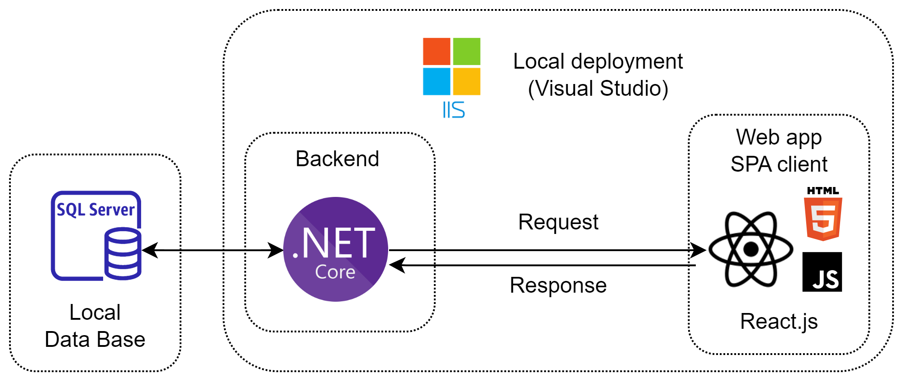
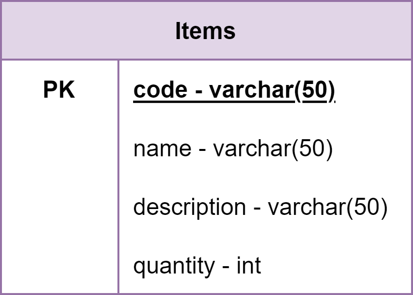

<p align="center">
 
</p>

<h2 align="center">Inventory Module</h2>

<p align="center"> 
Inventory administration module with React SPA and .NET Core backend.
    <br> 
</p>

---


## 📝 Table of Contents
- [About](#about)
- [Getting Started](#getting_started)
- [Planning Process](#planning)
- [Built Using](#built_using)

## 💡 About <a name = "about"></a>
Inventory Module is a full-stack project which simulates web platform for the administration of inventory in a company.

It uses the Single Web Application (SPA) methodology by rendering different components depending on the option chosen. As well, it uses a ReactJS with Bootstrap library to make the Frontend User Interface and .NET Core (C#) for the APIs in the backend.

The program connects with a relational database using MS SQL Server running locally, which is why a SQL migration script is provided. Additionally, it has been developed and tested in Visual Studio 2022, as it locally deploys both the backend and frontend with IIS Server.

<br>



<br>

## 🏁 Getting Started <a name = "getting_started"></a>

### Prerequisites

*The software requirements and their versions are listed in the <a name = "built_using"> Built Using </a> section. However, it would be necesary to use a Windows machine that can support the versions of the listed software.*

Before starting the project, the database should be running locally. To do so, install Microsoft SQL Server 2022 and SQL Server Management Studio (SSMS) 18 to visualize the Database. 

After the installation, find the "migration.sql" file in the "sql" directory. Open it with SSMS 18 and execute it with the "Execute" button or pressing "F5". With that, you'll have the database working locally.

### Installing

Clone the repository locally with the following command:

```
git clone https://github.com/avi-2-avi/inventory-module.git
```

Open the directory and navigate to the "src" directory. Open the "InventoryModule.sln" file in Visual Studio 2022.

In the Search bar of Visual Studio 2022, which is located in the upper part, search for "Manage NuGet Packages" and make sure that the following packages versions are installed:

Package | Version 
---|---
Microsoft.EntityFrameworkCore.SqlServer | 6.0.10 
Microsoft.EntityFrameworkCore.Tools | 6.0.11 
Microsoft.AspNetCore.SpaProxy | 6.0.11 

<!--Connecting to DB (for development)-->
<!---
Command for connecting to the database using Scaffold-DbContext in Package Manager Console (Tools -> NuGet Package Manager -> Package Manager Console):
https://learn.microsoft.com/en-us/ef/core/cli/powershell

Make sure your local database has Windows authentication mode or it won't work.

```
Scaffold-DbContext "Server=(local); DataBase=Inventory;Integrated Security=true;TrustServerCertificate=True" Microsoft.EntityFrameworkCore.SqlServer -OutPutDir Models
```
-->

After that, execute the project using "F5" or the InventoryModule button with the play sign. If everything was done correctly, the program will execute. 

If the data is not showing, make sure that the database is running locally and that it has "Windows Authentication", or else it won't work. If the program in not starting, make sure you have everything all the necesarry software installed.


#### Demo

https://user-images.githubusercontent.com/54769706/205129985-f1b3a0c3-ab32-4c4c-a9ec-3ddf98c3f57d.mp4


## 💭 Planning Process <a name = "planning"></a>

### Database
The "Inventory" database consists of only one table, where the code of the product is the primary key.

<div align="center" style="text-align:center">

</div>

### API Enpoints
Before the development, it has been important to define the enpoints needed.
#### Pagination of table data

- Request:
```
GET /
Accept: application/json
```
- Response:
```
HTTP/1.1 200 OK
Content-Type: application/json
```
```json
{
    "items": [
        {
            "code": "ART001",
            "name": "Detergente",
            "description": "Descripción",
            "quantity": 3
        },
        {
            ...
        }
        ...
    ]
}
```

#### Adding an item

- Request:
```
POST /
Accept: application/json
```
```json
{
    "item": 
        {
            "code": "ART001",
            "name": "Detergente",
            "description": "Descripción",
            "quantity": 3
        }
}
```

- Response:
```
HTTP/1.1 200 OK
Content-Type: application/json
```
#### Modifying an item

- Request:
```
PUT /
Accept: application/json
```
```json
{
    "item": 
        {
            "code": "ART001",
            "name": "Detergente",
            "description": "Descripción",
            "quantity": 3
        }
}
```

- Response:
```
HTTP/1.1 200 OK
Content-Type: application/json
```
#### Deleting an item

- Request:
```
DELETE /{code}
Accept: application/json
```

- Response:
```
HTTP/1.1 200 OK
Content-Type: application/json
```

## ⛏️ Built Using <a name = "built_using"></a>
- [Visual Studio 2022](https://visualstudio.microsoft.com/vs/) - IDE
- [.NET Core 6.0 LTS](https://dotnet.microsoft.com/en-us/download/dotnet/6.0) - Backend Framework
- [Microsoft SQL Server 2022](https://www.microsoft.com/en-us/sql-server/sql-server-downloads) - Database
- [SQL Server Management Studio 18](https://learn.microsoft.com/en-us/sql/ssms/download-sql-server-management-studio-ssms?redirectedfrom=MSDN&view=sql-server-ver16) - Database Manager
- [ReacJs v18.2.0](https://reactjs.org/) - Web Framework
- [Node v18.12.1 LTS](https://nodejs.org/en/) - Updating packages
